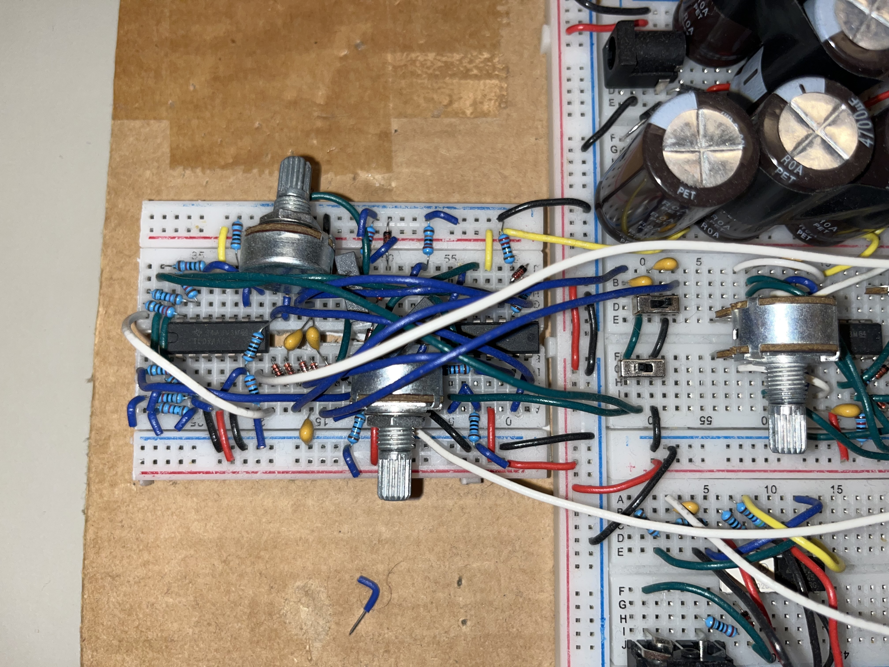

# Breadboard modular synth

Inspired by Moritz Klein I decided to take some of his lessons and other material and combine them to make a synth for myself. 
 
Primary goal of learning electronics in depth. 

### Current status: working 
### Current modules built: VCO, power supply, midi to CV, Active mixer, VCF. 

The circuits look so cramped because I want them each to be the size of one breadboard section(Half a full breadboard).

#### Power supply

#### MIDI to CV

#### VCO

#### Active mixer

#### VCF - LPF/HPF

#### LPF/HPF - no voltage control
